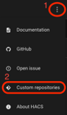
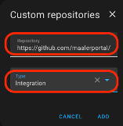

# Målerportal

This is a custom component for Home Assistant to integrate Målerportal.

## Prerequisits:

Ensure that HACS is installed.

Guide: https://www.hacs.xyz/docs/use/configuration/basic/#to-set-up-the-hacs-integration 
Guide docker: https://www.simplysmart.house/blog/how-to-install-HACS-on-home-assistant-Docker

## Installation:
- Go to “HACS” on the left-hand side of the Home Assistant dashboard
- Click the button I the top “right corner”  
    
- Add this repository (https://github.com/maalerportal/maalerportal) as a custom repository 

- After clicking the add button
- Press the X button
- Search for and download the "Målerportal" integration.
- Restart Home Assistant.
- After the restart go to “Settings” -> “Add Integration”
- Search and click on “Målerportal”         
  You will now be prompted for your login.
- Select what entity you want to add to your Home Assistant. (you can always add more later)
 
## Add the meter to your energy tab:

- In Home Assistant
- On the left side
- Click the “Energy” menu.
- Click the next button until you get to “Water consumption”
- Click “Add Water Source”
- Click the “Water usage” field
- Select the sensor (Entity) you wish to get displayed.
- Click “Save” 

You can now click “Show me my energy dashboard!” 
Here you will see your usage on a bar chart of your sensor (entity)